# OncoCalm

User experience design for OncoCalm: Outpatient cancer treatment follow-up.

## Index

- [1. Introduction](#1-introduction)
- [2. Team members and roles](#2-team-members-and-roles)
- [3. The strategy](#3-the-strategy)
    - [3.1. Value proposition canva](#31-value-proposition-canva)
    - [3.2. UX personas](#32-ux-persona)
- [4. The scope](#4-the-scope)
    - [4.1. Benchmarking](#41-benchmarking)
- [5. The structure](#5-the-structure)
    - [5.1. Navigation flow](#51-navigation-flow)
- [6. The skeleton](#6-the-skeleton)
    - [6.1. Low-fidelity wireframes](#61-low-fidelity-wireframes)
- [7. The surface](#7-the-surface)
    - [7.1. Interface evolution](#71-interface-evolution)
    - [7.2. High-fidelity interfaces](#72-high-fidelity-interfaces)

## 1. Introduction

> "As an outpatient chemotherapy patient, I need to record my daily symptoms and send them to my oncologist between sessions, so that she can detect any complication in time without needing me to go to the hospital in person."

Patients undergoing outpatient chemotherapy are required to record their symptoms, adverse reactions, and medications between sessions, but they lack a centralized tool to connect their records with the medical team. Communication usually occurs by phone or at the next appointment, which causes delays in the detection of complications.

The design must handle a sensitive context, with careful language and clear information hierarchy.

## 2. Team members and roles

- Martín Carrasco - *Proyect manager*
- David Baez - *Analyst*
- Sabrina López - *Designer*

## 3. The strategy

### 3.1. Value proposition canva

Conection between the user needs and the product.

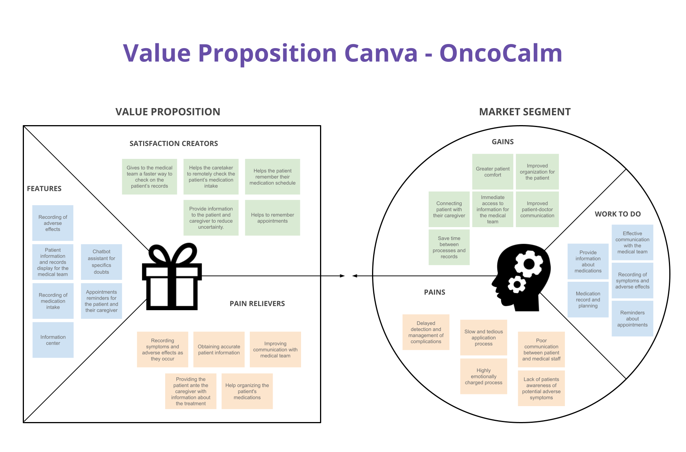

### 3.2. UX persona

The initial aproach covers 3 types of users:
- The patient, specifically one that is not familiar with the use of technology.
- The caregiver, specifically one that has a busy life but cares deeply for their family.
- The medical team, specifically an oncologist.

This option was selected because it should be broad enough for the team to accommodate the differents needs of people who know how to use mobile apps and those who do not.

#### The patient: Mrs. Trisha

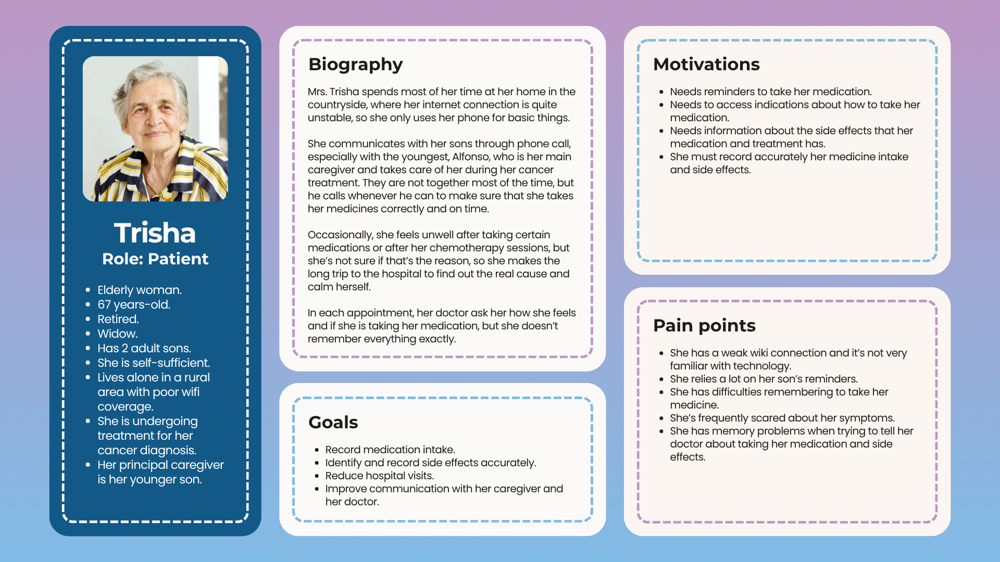

#### The caregiver: Alfonso

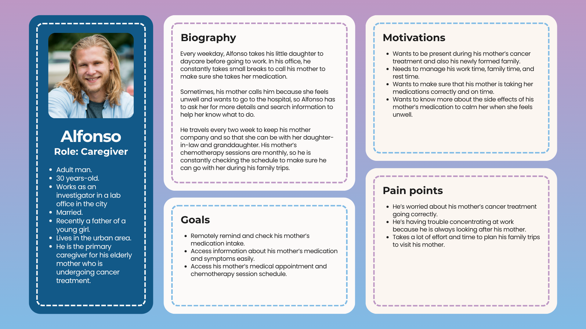

#### The doctor: Dr. Winry

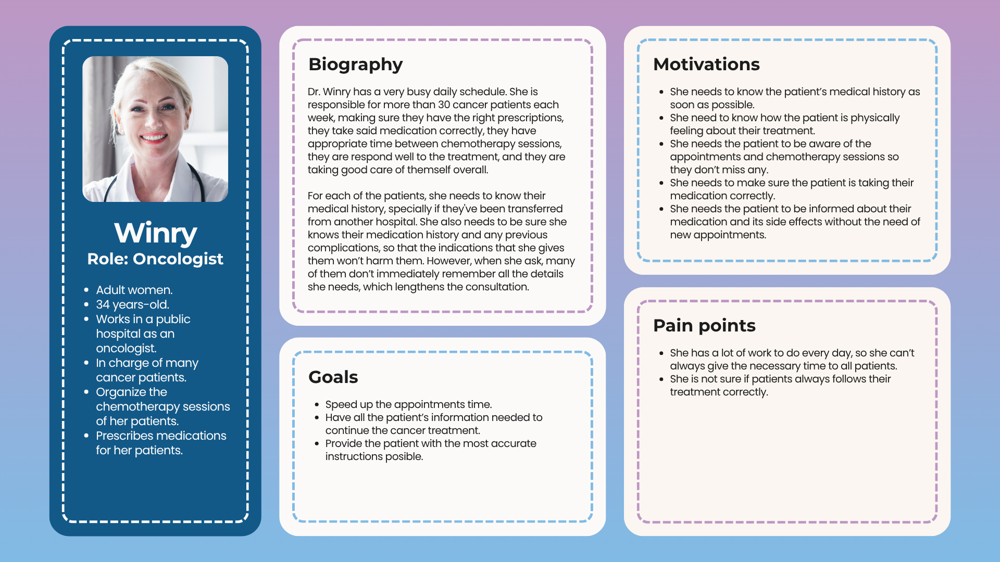

## 4. The scope

### 4.1. Benchmarking

To identify the domain standarts, the team developed the UX investigation technique of Benchmarking as part of the scope plane. This process consisted of two phases, the first one about scanning the available tools and solutions of the domain, and the second one about deepen the analysis and detect differentiating features.

The analized tools for this process where categorized in:
1. **Direct competitor** - Solve the same problem for the same target user profile.
    - *MyTherapy*: A medication reminder app that allows you to track other people's medication schedules. It includes features for tracking symptoms, vital signs, and upcoming medical appointments. It also has an interface for healthcare providers.
The web page of this tool can be found [here](https://www.mytherapyapp.com/es)
2. **Analog Competitor** - They solve a similar problem in a different domain, or the same problem for another segment.
    - *ONCOassist*: Application focused on oncology but strictly targeted towards the professional medical team. It supports treatment decision-making.
The web page of this tool can be found [here](https://oncoassist.com/)
3. **Design references** - They don't compete directly, but they set a relevant standard of experience for the domain.
    - *Google Calendar*: Reminders and event calendar application standard.
The web page of this tool can be found [here](https://workspace.google.com/intl/es-419/products/calendar/)

For the **phase 1**, the tools where reviewed in the following dimentions table:

| **Dimention** | **Direct competitor** | **Analog competitor** | **Desing reference** | **Team's proposal** |
|---|---|---|---|---|
| **Name** | MyTherapy | ONCOassist | Google Calendar | OncoCalm |
| **Platform** | Google Play (Android) and App Store (iOS) | Google Play (Android) and App Store (iOS) | Google Play (Android) and App Store (iOS) | Google Play (Android) and App Store (iOS) |
| **Analized version** | 3.266.1 | 9.27.2 | 2026.17.0-909654459-release | TBD |
| **Analysis Date** | May 12th, 2026 | May 14th, 2026 | May 15th, 2026 | May 15th, 2026 |
| **Link** | https://www.mytherapyapp.com/es | https://oncoassist.com/ | https://workspace.google.com/intl/es-419/products/calendar/ | TBD |
| **Target user profile** | Patient and caregiver, both need to remember, monitor, and record medication intake and the onset of symptoms. | Healthcare professionals in the field of oncology, who seek reliable resources to guide the treatments of their patients. | Various user profiles, mainly those who need to record events and reminders. | Patients undergoing cancer treatment, their responsible caregivers, and the oncology medical team. |
| **Value proposition** | MyTherapy is your personal, digital health companion. Reliable medication reminders and consistent documentation of your intakes. | The free go-to app for Oncology Professionals. | Make the most of your day with easy event creation, multiple calendars, customizable views, widgets, tasks, and more. | OncoCalm is an app focused on creating a connection between you, your caregiver, and your doctor during cancer treatment. Set reminders and records for your medication intake and symptoms, organize appointments, get precise information about your treatment, and easily share it with the medical team. All of this can be synced with your caregiver, so you don't feel alone during this challenging process. |
| **Main features** | Medication reminders, symptom and mood diary, creation of multiple profiles for different treatments, and generation of reports for the medical team. | Adjuvant tools, interactive formulas, prognostic scores, drugs information and interaction. | Creation of events, tasks, reminders, multiple views (day, month, agenda), and push notifications. | Reminders and monitoring of medication intake and symptoms, connection between patient user and caregiver user, recording of medical hours, convenient reading of recorded data for the medical team, availability of information on various aspects of cancer treatment (diagnosis, medications, side effects, contraindications). |
| **Onboarding flow** | First, the app asks for profile information such as name, sex, and year of birth, and a notification tone is set for the user. Next, the app allows the user to setup a routine by selecting the medication, the person who will take it, the frequency, and the times for taking it. Finally, the app asks for the current amount of medication on hand to determine when to restock, as well as the reason for taking it. | The application does not have an onboarding flow, only create an account. Users are initially asked for personal information such as their name and email address. Next, they are asked for their profession and a description of their work, what types of cancer they treat, and which ones they treat most frequently. Finally, they are asked to accept the terms and policies, to provide notifications, and to save their data. | The application does not have an onboarding system, as it relies on being intuitive. | The first page allows choosign between the user profile or medical team profile. |
| **Navigation patterns** | Bottom nav.: It uses the navigation bar at the bottom of the screen to move between the screens: Today, Progress, Support, and Therapy. Navigation depth: An average of 3 layers for everyday tasks, and for configuration tasks (like adding a medicine) 7 layers. | Bottom nav: It uses a navigation bar at the bottom of the screen, which allows to switch between Home, Favorites, and Notifications. Home Widgets: The Home page contains various widgets such as: Formulas, ONCOvideos, ONCOnews, Drug Info & Interation, among others. Navigation depth: An average of 6 levels | Gestures: It uses gestures to move between the calendar and weeks, as well as to increase or decrease the size of events. Side bar: It uses a sidebar that displays the different calendars, the different types of event visualizations, and the settings and help at the bottom. Navigation depth: For event tasks, around 2 levels, for settings, around 4 or 5 levels. | Botton nav.: It use the navigation bar at the bottom to move between the screens: Home, Schedule, Record, Help, and Profile. Voice assistant: It uses a voice search assistant to find sections of the application. |
| **Visual desing and consistency** | Color scheme is predominantly red and white (or dark grays in dark mode) with light purple accents for details. Sans-serif type of fonts. The iconography is simple, with simplified drawings for profile portraits. During the onboarding process, information is centered to avoid excessive white space in any area of the screen, but throughout the rest of the application, information is concentrated at the top. Therefore, if there is not a lot of information, there is white space between the information and the navigation bar. There is a high internal consistency in the design. | White and sky blue predominate in the color palette, the latter used for details. It does not have a dark mode. The typography is Sans-serif type. The iconography is simple, but the icon design is inconsistent. Onboarding information is vertically centered, but horizontally everything is closer to the top. There is moderate inconsistency in the design, because messages like "Updated" can be found in different shades of blue between screens. | The design is predominantly white, with accents in blue and light blue. It features a dark mode, in which the details change to a lighter shade of light blue. The typography is Google Sans, which is a Sans-serif type. The iconography is simple and self-explanatory. It includes a pseudo top bar, which displays the month and days of the week, though this may vary depending on the selected view. Information is organized below the top bar, allowing users to scroll to view different events. The design maintains a high degree of consistency. | Color scheme of blue, light blue, and white, reminiscent of colors used in the medical field, with details emphasized in light purple to convey a sense of calm and tranquility. Sans-serif typography. Simple iconography of line icons. |
| **Visible accessibility** | Legible font size, contrast that allows recognition of key features, labels on navigation icons, available dark mode, big size for important touch elements like confirmations, descriptions of features available on certain key screens, chatbot support. | Font size difficult to read, contrast that allows recognition of key functionalities, labels on navigation bar icons, no voice search, no dark mode, descriptions of different tools are available. | Legible font size, contrast that allows recognition of key functionalities, use of labels in the icons of the sidebar, supports voice control, dark mode available, big size for important touch elements, chatbot support by Google Assistant. | Large and legible font size, contrast with accent color for key features and selected buttons, labels on navigation bar icons, voice search for features, dark mode available, touch elements are big so they have a conisderable margin of error, especially for elderly people. |
| **Remarkable aspects** | 1. "Streak" system: An incentive to maintain consistent medication intake. 2. Indication of who the treatment is for: A clear indication to identify whether the reminder or record is for the user or another profile. |  1. Extensive data related to oncology tools and medications. 2. Medical calculators for dosages or calculating scores on oncology scales. | 1. Intuitive interface by using gestures and simple icons. 2. Easy reading of the different scheduled events. 3. Ability to share events. | 1. Syncronization between the patient and the caregiver profiles through the app. 2. Association with medical team with a specialized interface. |
| **Aspects that can be improved** |  1. Unclear symptom rating system: Since it relates to a scale used in a medical context, it fails to meet Nielsens heuristics regarding consistency and standards. 2. Partial functionality without an internet connection: Some tools like adding a medication routine or the chatbot do not work offline, and it does not notify users that an internet connection is required, failing to meet the Niesens heristics regarding recognition, diagnosis, and recovery from errors. 3. Use of ads as a source of revenue: the app targets older adults, and ads are difficult to dismiss, interrupting the flow state of the user at adding friction at the process. | 1. The functionality is not very intuitive; to delete favorites, you have to delete them from within, this does not apply Jakobs Law. 2. Large number of options on main page, its associated to the Choice Overload law. | 1. Lack of an onboarding system to learn how the app works, failing the Nielsen heuristic about help and documentation. 2. Certain settings can be hidden in too many steps, causing the user to forget where they are by the Miller's Law | 1. Limited onboarding (only 1 step), which fails the Nielsen heuristic of help and documentation. 2. Lack of "undo action" options, failing the Nielsen heuristic about user control and freedom. |

The feature map consisted in four core aspects:
- **Increase**: What is good about the compared app?
- **Reduce**: What should be maintained but reduced?
- **Include**: What should be implemented in the app?
- **Remove**: What should be removed to improve the experience?

An aditional mark for the **most relevant** features for the proposal was also considered.

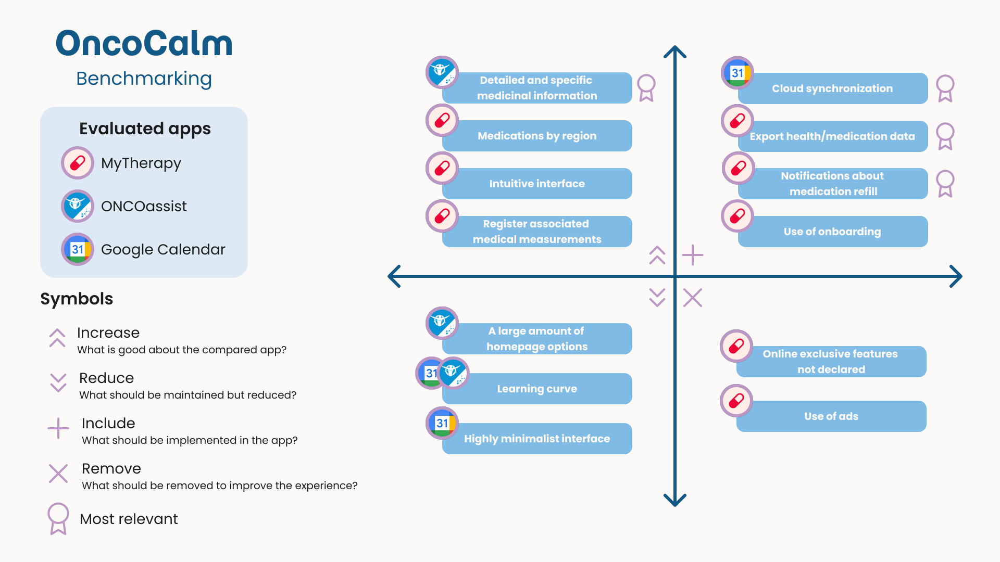

Based on the analysis and feature map created, the team was able to categorize the characteristics found into three aspects:

1. Domain standard features: 
When using and viewing all the tools, it was observed that no functionality within the health domain was repeated. This is because one of the applications analyzed was Google Calendar, which is substantially outside the health domain under study. However, when analyzing the health-focused tools (ONCOassist and MyTherapy), the following functionality was found to be common to both: 
    - Detailed and specific database of medications: While both tools provide detailed information about each medication, their approaches differ. ONCOAssist offers comprehensive information, including dosages, contraindications, and side effects. MyTherapy, on the other hand, focuses on user-friendliness by having drug databases organized by country.

2. Differentiating features:
Three differentiating functionalities contingent on the domain (health) were found that are relevant to the case study:
    - Cloud synchronization: Google Calendar allows data synchronization in the cloud, enabling users to have the same events on different devices.
    - Export health/medication data: MyTherapy allows you to export health-related data (weight), and medication-related data (time of intake and future schedule).
    - Notifications about medication refill: MyTherapy allows users to enter the amount of medication they have at the moment and select a threshold for when the app should notify about refilling.
3. Relevant features for the proposal:
Based on the analysis, gaps in functionality were identified, which represent opportunities for implementation in the proposal, such as:
    - Interface for medical staff: An analysis of the tools revealed that none of them include an interface for medical staff; therefore, we aim to incorporate a user interface that allows medical staff to view patient data via a generated QR code. This data will include medication intake dates, side effects, appointment schedules, and medication lists, among other details.
    - Synchronizing information with a caregiver: Upon analyzing the various tools, it was determined that none of them allowed for real-time information sharing between the patient and their caregiver (whether a family member or an external professional). For this reason, the proposal aims to integrate the ability to synchronize information across devices, enabling remote monitoring of the patient’s condition.

4. Features not implemented in the proposal:
The team found features that neither add nor detract from the value of the proposal: 
    - Use of ads as a monetization method: Upon analyzing the MyTherapy app, it was found to have two different monetization methods: The first one, its a pay-per-use option, with the choice of monthly, annual, or lifetime payments, and the second one, its the free version that uses ads. It was determined that the latter cannot be considered a monetization option for the proposal because it directly affects usability, especially for our target users, who are adults and elderly adults.
    - Online-only features not declared: The MyTherapy app offers both online and offline features, but it does not clearly inform users which features are online-only. As a result, if there is no internet connection, the feature fails to work, and the app does not explain why. The proposal aims to implement online features that clearly indicate their requirements, as well as report and mitigate any errors that occur.

In the **phase 2**, the comparative table was completed adding domain dimensions to the analysis: Data export, offline functionality, and language used (professional, formal, casual, warm, etc.).

The full table after both phases can be seen in PDF format in [this document](docs/Benchmark-Domains-table-OncoCalm.pdf).

A more comfortable/single view for each app can be found in the next sections.

| **Dimention** | **Direct competitor** | **Analog competitor** | **Desing reference** | **Team's proposal** |
|---|---|---|---|---|
| **Name** | MyTherapy | ONCOassist | Google Calendar | OncoCalm |
| **Platform** | Google Play (Android) and App Store (iOS) | Google Play (Android) and App Store (iOS) | Google Play (Android) and App Store (iOS) | Google Play (Android) and App Store (iOS) |
| **Analized version** | 3.266.1 | 9.27.2 | 2026.17.0-909654459-release | TBD |
| **Analysis Date** | May 12th, 2026 | May 14th, 2026 | May 15th, 2026 | May 15th, 2026 |
| **Link** | https://www.mytherapyapp.com/es | https://oncoassist.com/ | https://workspace.google.com/intl/es-419/products/calendar/ | TBD |
| **Target user profile** | Patient and caregiver, both need to remember, monitor, and record medication intake and the onset of symptoms. | Healthcare professionals in the field of oncology, who seek reliable resources to guide the treatments of their patients. | Various user profiles, mainly those who need to record events and reminders. | Patients undergoing cancer treatment, their responsible caregivers, and the oncology medical team. |
| **Value proposition** | MyTherapy is your personal, digital health companion. Reliable medication reminders and consistent documentation of your intakes. | The free go-to app for Oncology Professionals. | Make the most of your day with easy event creation, multiple calendars, customizable views, widgets, tasks, and more. | OncoCalm is an app focused on creating a connection between you, your caregiver, and your doctor during cancer treatment. Set reminders and records for your medication intake and symptoms, organize appointments, get precise information about your treatment, and easily share it with the medical team. All of this can be synced with your caregiver, so you don't feel alone during this challenging process. |
| **Main features** | Medication reminders, symptom and mood diary, creation of multiple profiles for different treatments, and generation of reports for the medical team. | Adjuvant tools, interactive formulas, prognostic scores, drugs information and interaction. | Creation of events, tasks, reminders, multiple views (day, month, agenda), and push notifications. | Reminders and monitoring of medication intake and symptoms, connection between patient user and caregiver user, recording of medical hours, convenient reading of recorded data for the medical team, availability of information on various aspects of cancer treatment (diagnosis, medications, side effects, contraindications). |
| **Onboarding flow** | First, the app asks for profile information such as name, sex, and year of birth, and a notification tone is set for the user. Next, the app allows the user to setup a routine by selecting the medication, the person who will take it, the frequency, and the times for taking it. Finally, the app asks for the current amount of medication on hand to determine when to restock, as well as the reason for taking it. | The application does not have an onboarding flow, only create an account. Users are initially asked for personal information such as their name and email address. Next, they are asked for their profession and a description of their work, what types of cancer they treat, and which ones they treat most frequently. Finally, they are asked to accept the terms and policies, to provide notifications, and to save their data. | The application does not have an onboarding system, as it relies on being intuitive. | The first page allows choosign between the user profile or medical team profile. |
| **Navigation patterns** | Bottom nav.: It uses the navigation bar at the bottom of the screen to move between the screens: Today, Progress, Support, and Therapy. Navigation depth: An average of 3 layers for everyday tasks, and for configuration tasks (like adding a medicine) 7 layers. | Bottom nav: It uses a navigation bar at the bottom of the screen, which allows to switch between Home, Favorites, and Notifications. Home Widgets: The Home page contains various widgets such as: Formulas, ONCOvideos, ONCOnews, Drug Info & Interation, among others. Navigation depth: An average of 6 levels | Gestures: It uses gestures to move between the calendar and weeks, as well as to increase or decrease the size of events. Side bar: It uses a sidebar that displays the different calendars, the different types of event visualizations, and the settings and help at the bottom. Navigation depth: For event tasks, around 2 levels, for settings, around 4 or 5 levels. | Botton nav.: It use the navigation bar at the bottom to move between the screens: Home, Schedule, Record, Help, and Profile. Voice assistant: It uses a voice search assistant to find sections of the application. |
| **Visual desing and consistency** | Color scheme is predominantly red and white (or dark grays in dark mode) with light purple accents for details. Sans-serif type of fonts. The iconography is simple, with simplified drawings for profile portraits. During the onboarding process, information is centered to avoid excessive white space in any area of the screen, but throughout the rest of the application, information is concentrated at the top. Therefore, if there is not a lot of information, there is white space between the information and the navigation bar. There is a high internal consistency in the design. | White and sky blue predominate in the color palette, the latter used for details. It does not have a dark mode. The typography is Sans-serif type. The iconography is simple, but the icon design is inconsistent. Onboarding information is vertically centered, but horizontally everything is closer to the top. There is moderate inconsistency in the design, because messages like "Updated" can be found in different shades of blue between screens. | The design is predominantly white, with accents in blue and light blue. It features a dark mode, in which the details change to a lighter shade of light blue. The typography is Google Sans, which is a Sans-serif type. The iconography is simple and self-explanatory. It includes a pseudo top bar, which displays the month and days of the week, though this may vary depending on the selected view. Information is organized below the top bar, allowing users to scroll to view different events. The design maintains a high degree of consistency. | Color scheme of blue, light blue, and white, reminiscent of colors used in the medical field, with details emphasized in light purple to convey a sense of calm and tranquility. Sans-serif typography. Simple iconography of line icons. |
| **Visible accessibility** | Legible font size, contrast that allows recognition of key features, labels on navigation icons, available dark mode, big size for important touch elements like confirmations, descriptions of features available on certain key screens, chatbot support. | Font size difficult to read, contrast that allows recognition of key functionalities, labels on navigation bar icons, no voice search, no dark mode, descriptions of different tools are available. | Legible font size, contrast that allows recognition of key functionalities, use of labels in the icons of the sidebar, supports voice control, dark mode available, big size for important touch elements, chatbot support by Google Assistant. | Large and legible font size, contrast with accent color for key features and selected buttons, labels on navigation bar icons, voice search for features, dark mode available, touch elements are big so they have a conisderable margin of error, especially for elderly people. |
| **Remarkable aspects** | 1. "Streak" system: An incentive to maintain consistent medication intake. 2. Indication of who the treatment is for: A clear indication to identify whether the reminder or record is for the user or another profile. |  1. Extensive data related to oncology tools and medications. 2. Medical calculators for dosages or calculating scores on oncology scales. | 1. Intuitive interface by using gestures and simple icons. 2. Easy reading of the different scheduled events. 3. Ability to share events. | 1. Syncronization between the patient and the caregiver profiles through the app. 2. Association with medical team with a specialized interface. |
| **Aspects that can be improved** |  1. Unclear symptom rating system: Since it relates to a scale used in a medical context, it fails to meet Nielsens heuristics regarding consistency and standards. 2. Partial functionality without an internet connection: Some tools like adding a medication routine or the chatbot do not work offline, and it does not notify users that an internet connection is required, failing to meet the Niesens heristics regarding recognition, diagnosis, and recovery from errors. 3. Use of ads as a source of revenue: the app targets older adults, and ads are difficult to dismiss, interrupting the flow state of the user at adding friction at the process. | 1. The functionality is not very intuitive; to delete favorites, you have to delete them from within, this does not apply Jakobs Law. 2. Large number of options on main page, its associated to the Choice Overload law. | 1. Lack of an onboarding system to learn how the app works, failing the Nielsen heuristic about help and documentation. 2. Certain settings can be hidden in too many steps, causing the user to forget where they are by the Miller's Law | 1. Limited onboarding (only 1 step), which fails the Nielsen heuristic of help and documentation. 2. Lack of "undo action" options, failing the Nielsen heuristic about user control and freedom. |
| **Data export** | It allows to export the recorded data as PDF, one month at a time. | It does not allow exporting data. | Event data can be synced with other platforms like Apple Calendar or Samsung Calendar, but not specifically export. | It allows exporting the recorded data via QR code for the medical team, and connects the application with another user via invitation link. |
| **Offline functionality** | Partial functionality: some features (for example, adding a medication) require an internet connection, yet the system does not inform users about this. | It allows offline operation, but reducing functions. | It allows you to view all events and add new ones. | All features are available, except for real-time notification between users. |
| **Language used** | User-friendly language. | Professional and formal language, using technical language about oncology in most of the app. | Neutral language, not too friendly and not too formal. | User-friendly language. |

### MyTherapy

The detailed analysis for the MyTherapy app is present in the next table:

| **Dimention** | **Direct competitor** |
|---|---|
| **Name** | MyTherapy |
| **Platform** | Google Play (Android) and App Store (iOS) |
| **Analized version** | 3.266.1 |
| **Analysis Date** | May 12th, 2026 |
| **Link** | https://www.mytherapyapp.com/es |
| **Target user profile** | Patient and caregiver, both need to remember, monitor, and record medication intake and the onset of symptoms. |
| **Value proposition** | MyTherapy is your personal, digital health companion. Reliable medication reminders and consistent documentation of your intakes. |
| **Main features** | Medication reminders, symptom and mood diary, creation of multiple profiles for different treatments, and generation of reports for the medical team. |
| **Onboarding flow** | First, the app asks for profile information such as name, sex, and year of birth, and a notification tone is set for the user. Next, the app allows the user to setup a routine by selecting the medication, the person who will take it, the frequency, and the times for taking it. Finally, the app asks for the current amount of medication on hand to determine when to restock, as well as the reason for taking it. |
| **Navigation patterns** | Bottom nav.: It uses the navigation bar at the bottom of the screen to move between the screens: Today, Progress, Support, and Therapy. Navigation depth: An average of 3 layers for everyday tasks, and for configuration tasks (like adding a medicine) 7 layers. |
| **Visual desing and consistency** | Color scheme is predominantly red and white (or dark grays in dark mode) with light purple accents for details. Sans-serif type of fonts. The iconography is simple, with simplified drawings for profile portraits. During the onboarding process, information is centered to avoid excessive white space in any area of the screen, but throughout the rest of the application, information is concentrated at the top. Therefore, if there is not a lot of information, there is white space between the information and the navigation bar. There is a high internal consistency in the design. |
| **Visible accessibility** | Legible font size, contrast that allows recognition of key features, labels on navigation icons, available dark mode, big size for important touch elements like confirmations, descriptions of features available on certain key screens, chatbot support. |
| **Remarkable aspects** | 1. "Streak" system: An incentive to maintain consistent medication intake. 2. Indication of who the treatment is for: A clear indication to identify whether the reminder or record is for the user or another profile. |
| **Aspects that can be improved** |  1. Unclear symptom rating system: Since it relates to a scale used in a medical context, it fails to meet Nielsens heuristics regarding consistency and standards. 2. Partial functionality without an internet connection: Some tools like adding a medication routine or the chatbot do not work offline, and it does not notify users that an internet connection is required, failing to meet the Niesens heristics regarding recognition, diagnosis, and recovery from errors. 3. Use of ads as a source of revenue: the app targets older adults, and ads are difficult to dismiss, interrupting the flow state of the user at adding friction at the process. |
| **Data export** | It allows to export the recorded data as PDF, one month at a time. |
| **Offline functionality** | Partial functionality: some features (for example, adding a medication) require an internet connection, yet the system does not inform users about this. |
| **Language used** | User-friendly language. |

#### Anotated screenshots

The *medication refill* page was chosen because it is part of the onboarding process, therefore, is presented as an essential step for the user to be aware of it.
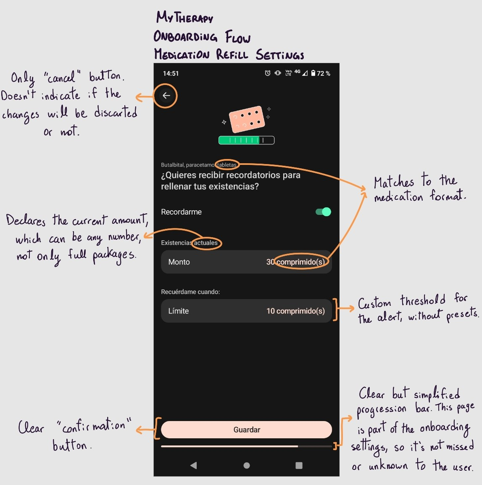

The *today* page is relevant to be analyzed because it has features that captured the team’s attention, such as the profile tag for the medication and the streak.
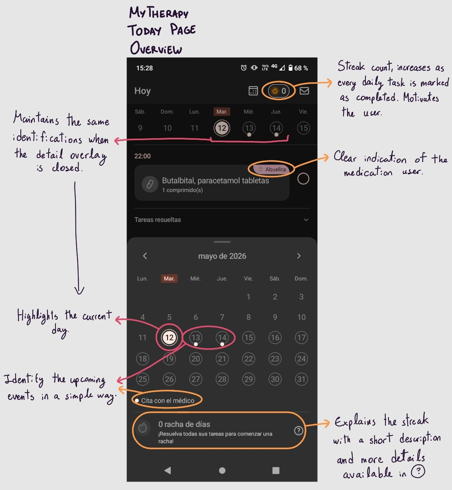

The *record symptom* page is important because it serves as a very close reference for the type of information needed for the records in the proposal.
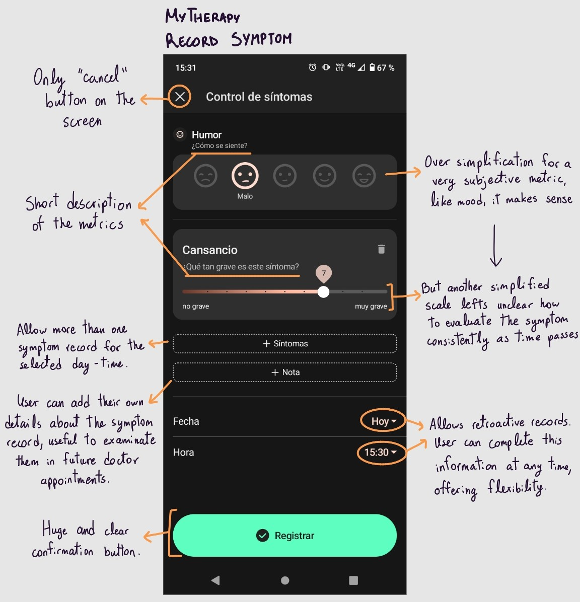

The add medication reminder page is analyzed from the clarity of its information, regarding both the medication and the functionality itself.
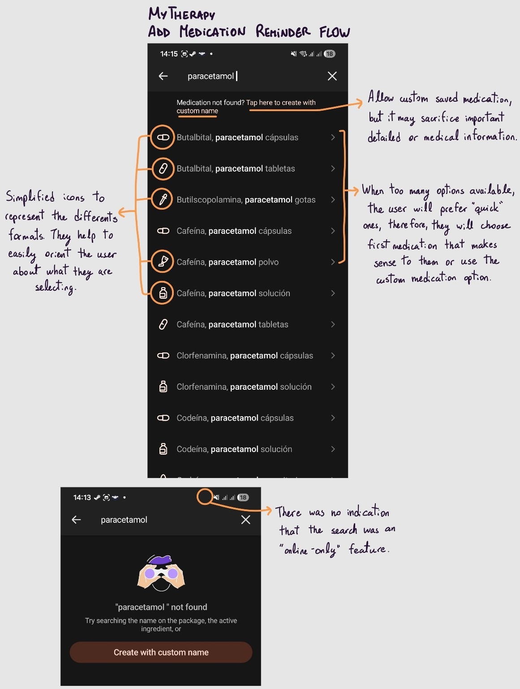

### ONCOassist

The detailed analysis for the ONCOassist app is present in the next table:

| **Dimention** | **Analog competitor** |
|---|---|
| **Name** | ONCOassist |
| **Platform** | Google Play (Android) and App Store (iOS) |
| **Analized version** | 9.27.2 |
| **Analysis Date** | May 14th, 2026 |
| **Link** | https://oncoassist.com/ |
| **Target user profile** | Healthcare professionals in the field of oncology, who seek reliable resources to guide the treatments of their patients. |
| **Value proposition** | The free go-to app for Oncology Professionals. |
| **Main features** | Adjuvant tools, interactive formulas, prognostic scores, drugs information and interaction. |
| **Onboarding flow** | The application does not have an onboarding flow, only create an account. Users are initially asked for personal information such as their name and email address. Next, they are asked for their profession and a description of their work, what types of cancer they treat, and which ones they treat most frequently. Finally, they are asked to accept the terms and policies, to provide notifications, and to save their data. |
| **Navigation patterns** | Bottom nav: It uses a navigation bar at the bottom of the screen, which allows to switch between Home, Favorites, and Notifications. Home Widgets: The Home page contains various widgets such as: Formulas, ONCOvideos, ONCOnews, Drug Info & Interation, among others. Navigation depth: An average of 6 levels |
| **Visual desing and consistency** | White and sky blue predominate in the color palette, the latter used for details. It does not have a dark mode. The typography is Sans-serif type. The iconography is simple, but the icon design is inconsistent. Onboarding information is vertically centered, but horizontally everything is closer to the top. There is moderate inconsistency in the design, because messages like "Updated" can be found in different shades of blue between screens. |
| **Visible accessibility** | Font size difficult to read, contrast that allows recognition of key functionalities, labels on navigation bar icons, no voice search, no dark mode, descriptions of different tools are available. |
| **Remarkable aspects** |  1. Extensive data related to oncology tools and medications. 2. Medical calculators for dosages or calculating scores on oncology scales. |
| **Aspects that can be improved** | 1. The functionality is not very intuitive; to delete favorites, you have to delete them from within, this does not apply Jakobs Law. 2. Large number of options on main page, its associated to the Choice Overload law. |
| **Data export** | It does not allow exporting data. |
| **Offline functionality** | It allows offline operation, but reducing functions. |
| **Language used** | Professional and formal language, using technical language about oncology in most of the app. |

#### Anotated screenshots

The *home* page is selected as a reference for the amount of options available in a main page and the distribution of them.
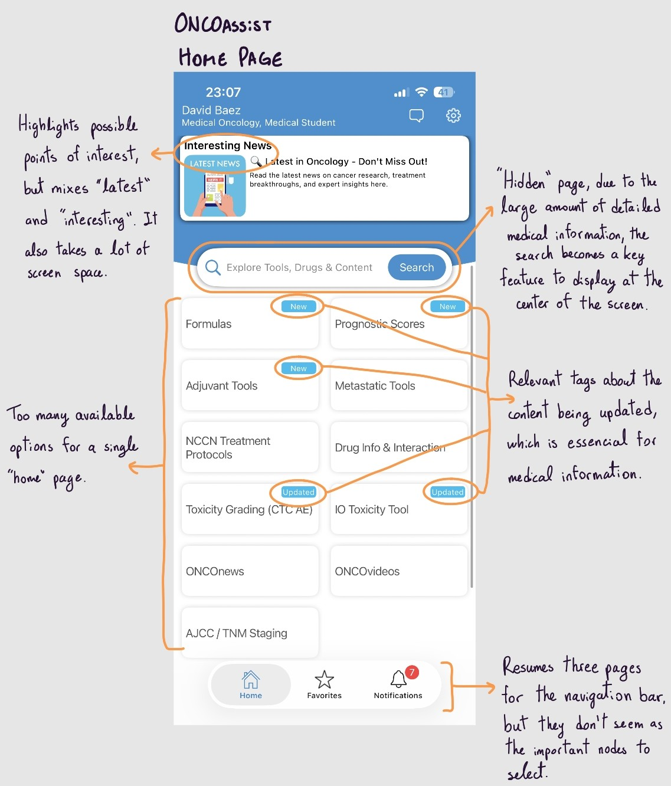

The *news* page is analyzed to identify the relevant data that should be displayed when summarizing large amounts of information.
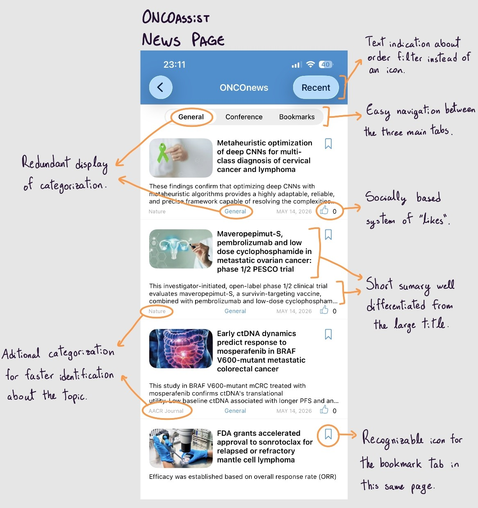

The *search flow* is a very central part of the ONCOassist app, so it’s analyzed as part of reviewing how the navigation is established in it.
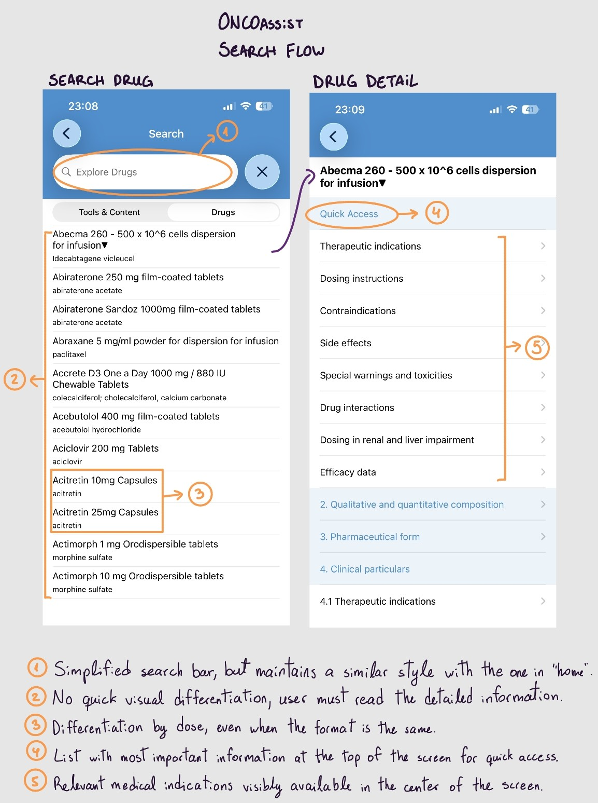

### Google calendar

The detailed analysis for the Google Calendar app is present in the next table:

| **Dimention** | **Desing reference** |
|---|---|
| **Name** | Google Calendar |
| **Platform** | Google Play (Android) and App Store (iOS) |
| **Analized version** | 2026.17.0-909654459-release |
| **Analysis Date** | May 15th, 2026 |
| **Link** | https://workspace.google.com/intl/es-419/products/calendar/ |
| **Target user profile** | Various user profiles, mainly those who need to record events and reminders. |
| **Value proposition** | Make the most of your day with easy event creation, multiple calendars, customizable views, widgets, tasks, and more. |
| **Main features** | Creation of events, tasks, reminders, multiple views (day, month, agenda), and push notifications. |
| **Onboarding flow** | The application does not have an onboarding system, as it relies on being intuitive. |
| **Navigation patterns** | Gestures: It uses gestures to move between the calendar and weeks, as well as to increase or decrease the size of events. Side bar: It uses a sidebar that displays the different calendars, the different types of event visualizations, and the settings and help at the bottom. Navigation depth: For event tasks, around 2 levels, for settings, around 4 or 5 levels. |
| **Visual desing and consistency** | The design is predominantly white, with accents in blue and light blue. It features a dark mode, in which the details change to a lighter shade of light blue. The typography is Google Sans, which is a Sans-serif type. The iconography is simple and self-explanatory. It includes a pseudo top bar, which displays the month and days of the week, though this may vary depending on the selected view. Information is organized below the top bar, allowing users to scroll to view different events. The design maintains a high degree of consistency. |
| **Visible accessibility** | Legible font size, contrast that allows recognition of key functionalities, use of labels in the icons of the sidebar, supports voice control, dark mode available, big size for important touch elements, chatbot support by Google Assistant. |
| **Remarkable aspects** | 1. Intuitive interface by using gestures and simple icons. 2. Easy reading of the different scheduled events. 3. Ability to share events. |
| **Aspects that can be improved** | 1. Lack of an onboarding system to learn how the app works, failing the Nielsen heuristic about help and documentation. 2. Certain settings can be hidden in too many steps, causing the user to forget where they are by the Miller's Law |
| **Data export** | Event data can be synced with other platforms like Apple Calendar or Samsung Calendar, but not specifically export. |
| **Offline functionality** | It allows you to view all events and add new ones. |
| **Language used** | Neutral language, not too friendly and not too formal. |

#### Anotated screenshots

The *add new event* page is a key feature to organize a schedule, so it’s an important part of the analysis.
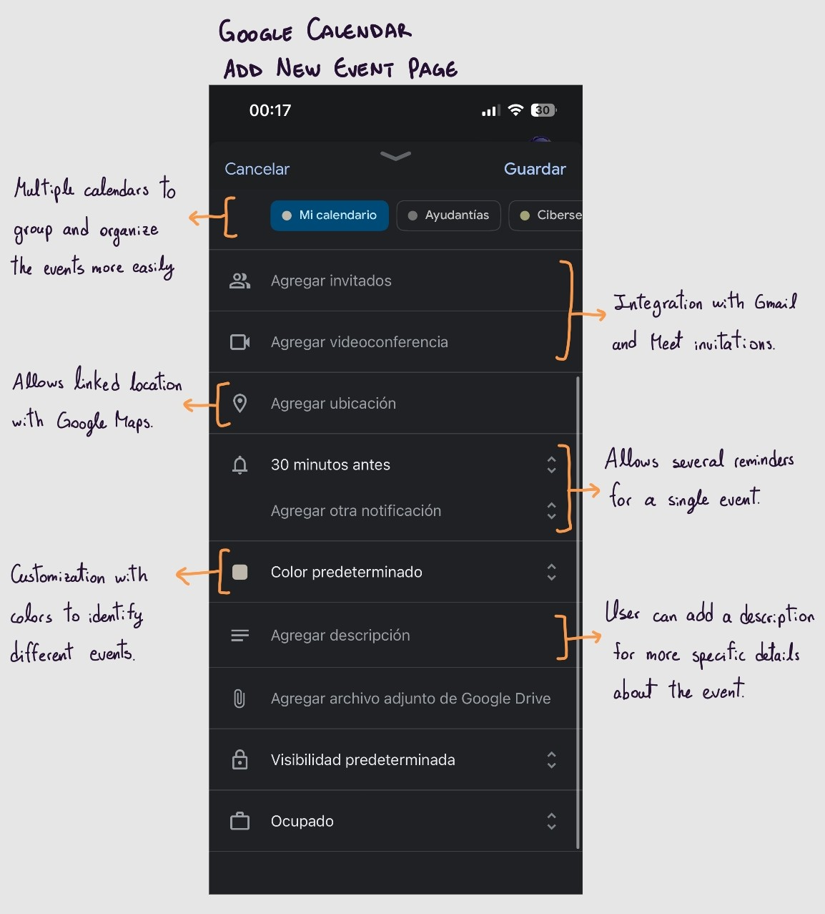

The *schedule* page is the other key feature of this, because it allows the team to identify which details are hidden, and which details are needed.
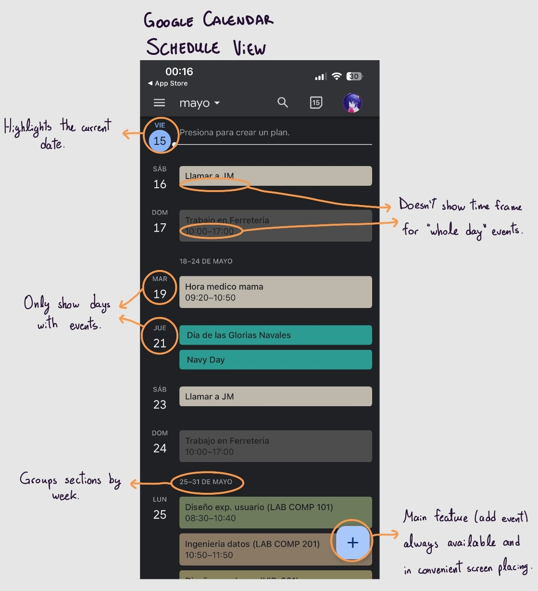

The *week view with the month overview* page is important to determine how the information is condensed when showing a resume of everything, and how the periods of times guide the navigation on the screen.
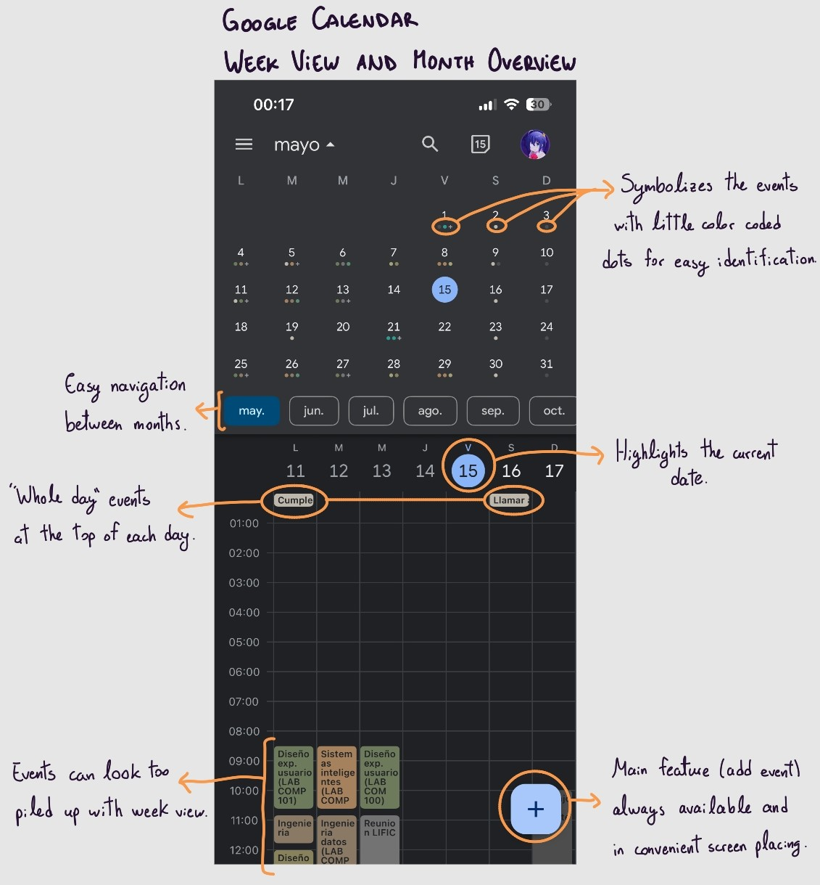

### Team's proposal

The detailed analysis for the team's proposal is present in the next table:

| **Dimention** | **Team's proposal** |
|---|---|
| **Name** | OncoCalm |
| **Platform** | Google Play (Android) and App Store (iOS) |
| **Analized version** | TBD |
| **Analysis Date** | May 15th, 2026 |
| **Link** | TBD |
| **Target user profile** | Patients undergoing cancer treatment, their responsible caregivers, and the oncology medical team. |
| **Value proposition** | OncoCalm is an app focused on creating a connection between you, your caregiver, and your doctor during cancer treatment. Set reminders and records for your medication intake and symptoms, organize appointments, get precise information about your treatment, and easily share it with the medical team. All of this can be synced with your caregiver, so you don't feel alone during this challenging process. |
| **Main features** | Reminders and monitoring of medication intake and symptoms, connection between patient user and caregiver user, recording of medical hours, convenient reading of recorded data for the medical team, availability of information on various aspects of cancer treatment (diagnosis, medications, side effects, contraindications). |
| **Onboarding flow** | The first page allows choosign between the user profile or medical team profile. |
| **Navigation patterns** | Botton nav.: It use the navigation bar at the bottom to move between the screens: Home, Schedule, Record, Help, and Profile. Voice assistant: It uses a voice search assistant to find sections of the application. |
| **Visual desing and consistency** | Color scheme of blue, light blue, and white, reminiscent of colors used in the medical field, with details emphasized in light purple to convey a sense of calm and tranquility. Sans-serif typography. Simple iconography of line icons. |
| **Visible accessibility** | Large and legible font size, contrast with accent color for key features and selected buttons, labels on navigation bar icons, voice search for features, dark mode available, touch elements are big so they have a conisderable margin of error, especially for elderly people. |
| **Remarkable aspects** | 1. Syncronization between the patient and the caregiver profiles through the app. 2. Association with medical team with a specialized interface. |
| **Aspects that can be improved** | 1. Limited onboarding (only 1 step), which fails the Nielsen heuristic of help and documentation. 2. Lack of "undo action" options, failing the Nielsen heuristic about user control and freedom. |
| **Data export** | It allows exporting the recorded data via QR code for the medical team, and connects the application with another user via invitation link. |
| **Offline functionality** | All features are available, except for real-time notification between users. |
| **Language used** | User-friendly language. |

### Findigns and design decisions

Based on the exhaustive analysis of the different tools, various characteristics, both positive and negative, were identified. The following patterns are obtained from them, which will be adapted or avoided in the proposal made:
1. Adapted patterns:
    - We adapted the detailed and specific database of medications of the ONCOAssist app, because in this way, users will be able to have extensive information on side effects, contraindications, and maximum doses.
    - We adapted the medication refill feature implemented in the MyTherapy app because it allows users to partially offload the burden of managing their medication supply.
2. Rejected patterns:
    - We rejected the use of ads as a monetization method of the MyTherapy app, because it affects the usability of the application and, when dealing with cancer patients, it is desirable to avoid the emotional burden that this could entail.
    - We rejected the pattern where online-only features were not declared in the MyTharapy app, because if the user uses the app offline, they may be displeased to find that a key feature does not work without connection and they were unaware of this.

## 5. The structure

### 5.1. Navigation flow

Some pages change their content based on permissions according to the profile type: (Patient, Caregiver, or Medical Team).

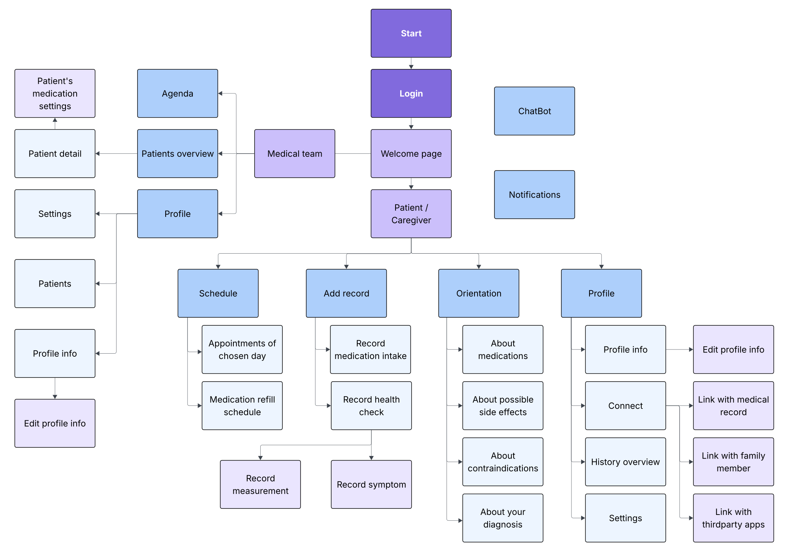

## 6. The skeleton

### 6.1. Low-fidelity wireframes 

All the wireframes made in Figma for the proyect can be seen in the [wireframes document](https://www.figma.com/design/nJTU6E2fDiijucy9F9Slyt/Wireframes-OncoCalm?node-id=0-1&t=PHzTZDU5pTgUWFFo-1).

## 7. The surface

### 7.1. Interface Evolution

### 7.2. High-fidelity interfaces