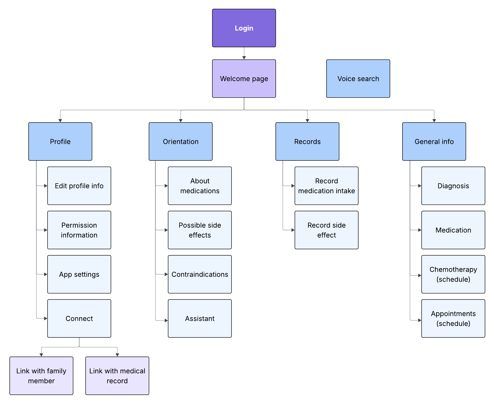

# OncoCalm

User experience design for OncoCalm: Outpatient cancer treatment follow-up

## Index

- [1. Introduction](#1-introduction)
- [2. Team members and roles](#2-team-members-and-roles)
- [3. The strategy](#3-the-strategy)
    - [3.1. Value proposition canva](#31-value-proposition-canva)
    - [3.2. UX personas](#32-ux-persona)
    - [3.3. Benchmarking](#33-benchmarking)
- [4. The scope](#4-the-scope)
- [5. The structure](#5-the-structure)
    - [5.1. Navigation flow](#51-navigation-flow)
- [6. The skeleton](#6-the-skeleton)
- [7. The surface](#7-the-surface)

## 1. Introduction

> "As an outpatient chemotherapy patient, I need to record my daily symptoms and send them to my oncologist between sessions, so that she can detect any complication in time without needing me to go to the hospital in person."

Patients undergoing outpatient chemotherapy are required to record their symptoms, adverse reactions, and medications between sessions, but they lack a centralized tool to connect their records with the medical team. Communication usually occurs by phone or at the next appointment, which causes delays in the detection of complications.

The design must handle a sensitive context, with careful language and clear information hierarchy.

## 2. Team members and roles

- Martín Carrasco - *Proyect manager*
- David Báez - *Analyst*
- Sabrina López - *Designer*

## 3. The strategy

### 3.1. Value proposition canva

Conection between the user needs and the product

### 3.2. UX persona

The initial aproach covers 3 types of users:
- The patient, specifically one that is not familiar with the use of technology.
- The caregiver, specifically one that has a busy life but cares deeply for their family.
- The medical team, specifically an oncologist.

This option was selected because it should be broad enough for the team to accommodate the differents needs of people who know how to use mobile apps and those who do not.

#### The patient: Mrs. Trisha

#### The caregiver: Alfonso

#### The doctor: Dr. Winry

### 3.3. Benchmarking

## 4. The scope

## 5. The structure

### 5.1. Navigation flow

Some pages change their content based on permissions according to the profile type: (Patient, Caregiver, or Medical Team).

## 6. The skeleton

## 7. The surface